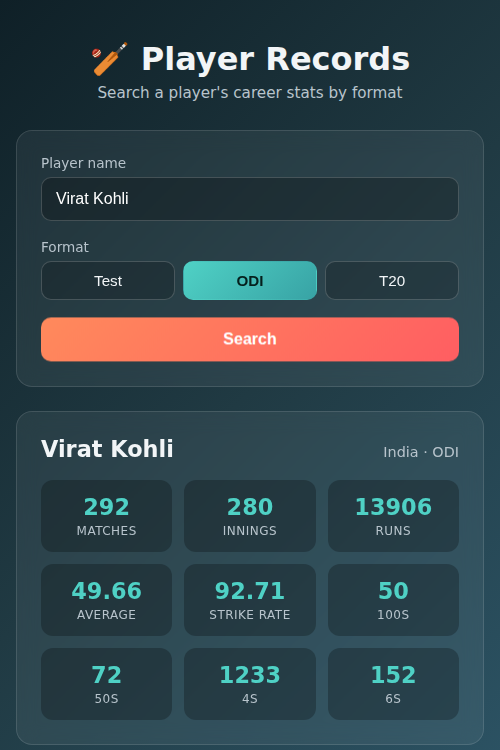

# Records

A cricket player statistics app: a Spring Boot backend backed by Postgres, with a
built-in web UI for looking up a player's career numbers by format.

## What it does

- Search for a player by name and pick a format — **Test**, **ODI**, or **T20**.
- See that player's stats for the chosen format: matches, innings, runs, average,
  strike rate, hundreds, fifties, fours and sixes.
- Stats are tracked per format, so the same player can have different numbers for
  Test/ODI/T20 (a batting average in Tests is not the same as in T20s).
- A few sample players (Virat Kohli, Joe Root, Babar Azam) are seeded on first
  startup so there's data to search right away.



## Live demo

[](https://render.com/deploy?repo=https://github.com/vinaysai9440/Records)

**Live link:** https://records-17zn.onrender.com/

(Free-tier Render services spin down after inactivity, so the first load
after a while may take 30-60 seconds to wake up.)

The blueprint deploys the app with the in-memory `dev` profile, so no database
setup is needed — it comes up with the seeded sample players out of the box.
Data resets whenever the service restarts or redeploys, so this is meant for
demoing the UI, not for storing real data (use the Postgres setup below for that).

## Tech stack

- Java 21, Spring Boot 3 (Web, Data JPA, Security, AOP)
- PostgreSQL (production), H2 in-memory (local `dev` profile)
- Plain HTML/CSS/JS front end, served as static resources by Spring Boot —
  no separate frontend build/toolchain required

## Running it

### Locally, no database setup (H2)

```bash
SPRING_PROFILES_ACTIVE=dev ./gradlew bootRun
```

Then open http://localhost:8080.

### Against Postgres

Set connection details via environment variables (defaults assume a local
Postgres with a `player_stats` schema):

```bash
export DB_URL=jdbc:postgresql://localhost:5432/postgres?currentSchema=player_stats
export DB_USERNAME=postgres
export DB_PASSWORD=your-password
./gradlew bootRun
```

## API

| Method | Endpoint             | Auth       | Description                                  |
|--------|-----------------------|------------|-----------------------------------------------|
| GET    | `/api/players/stats`  | Public     | `?playerName=...&format=TEST\|ODI\|T20`       |
| GET    | `/api/players/names`  | Public     | List of all player names (used for autocomplete) |
| POST   | `/api/players`        | HTTP Basic | Create a player (`playerName`, `country`)     |
| POST   | `/api/players/stats`  | HTTP Basic | Add/update a player's stats for a format      |

Write endpoints require HTTP Basic auth (`admin` / `password` by default —
see `SecurityConfig`).

## Roadmap

More features are planned on top of this foundation (e.g. player rankings/leaderboards
per format, which the data model already has a starting point for in `PlayerRanking`).
